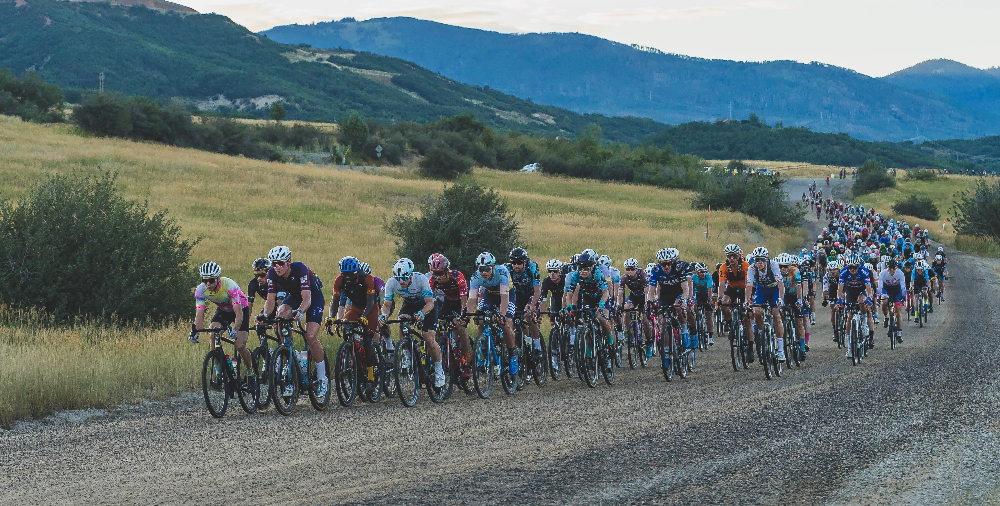

WattsPerKilo is a place to share my latest experiences using lightweight bike parts, from the perspective of someone who pushes the equipment to its limits. I'm a retired racer turned Strava/equipment junkie, who spends his free time riding hard up mountains and smashing group rides. I have no sponsor ties, so I do my best to test everything out there but I am more value-oriented than publications who get (and often keep) endless review samples.  

Based in Boulder, CO, the riding here is pretty unique. The best climbs and roads are all on hard-pack dirt, which means bikes get ridden harder than pretty much any place out there. Ride up on the dirt then descend on pavement (if there is any).