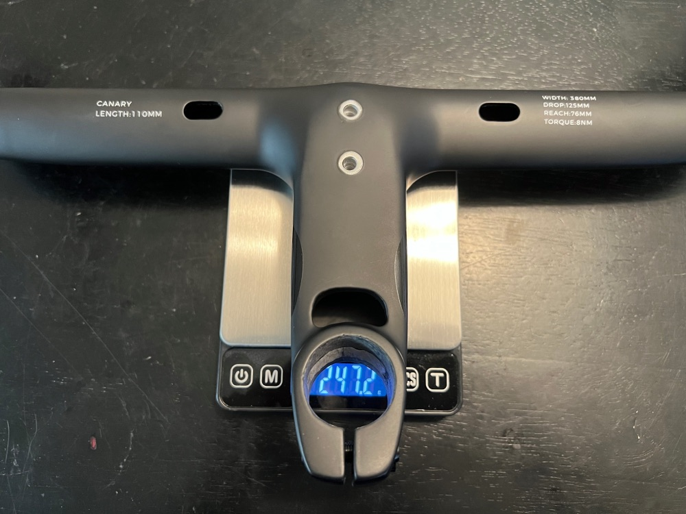
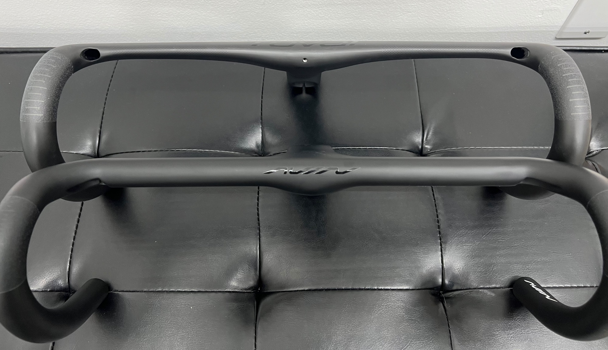
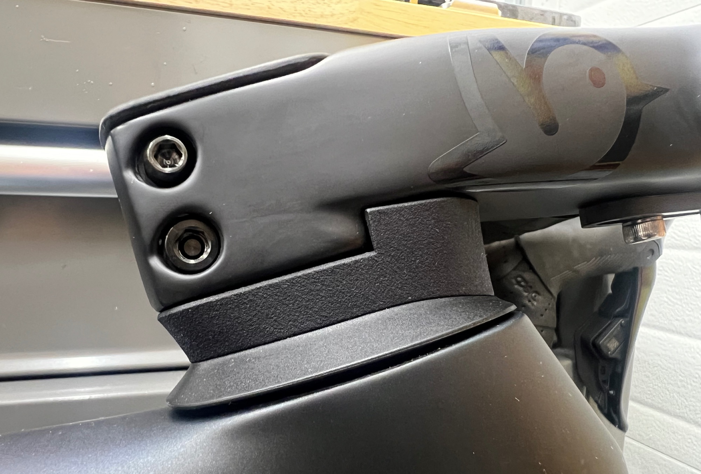
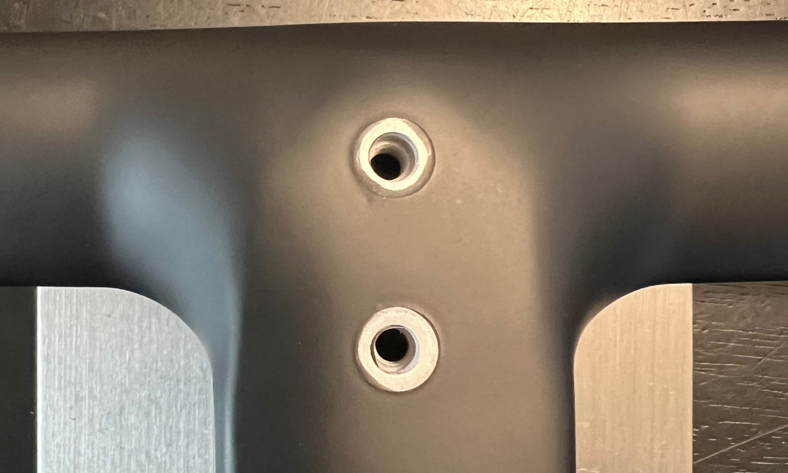

As one of the lightest one-piece handlebars on the market, I decided to take a gamble with the Avian Canary handlebars. At ~$250, they are much less expensive than name brands but still have their own factory and brand which makes them appealing.

### Overview

|   | Avian Canary | Roval Rapide Cockpit | Roval Alpinist Cockpit II | Darimo Nexum |
|---|---|---|---|---|
| Weight | ~247g | ~310g | 270g | ~195g |
| Price (USD) | ~$250 | $699 | $699 | ~$900 |
| Reach | 76mm | 75mm | 75mm | 77mm |
| Drop | 125mm | 125mm | 125mm | 128mm |

The general consensus online is that they are very flexy, and I can confirm that. However, I don't believe that the lack of stiffness is necessarily a bad thing. I'm 67kg, and didn't have an issue sprinting on them, but I am used to flexy bars coming from the Darimo Eclipse bars.

The weight came in slightly higher than advertised at 247g. Still much lighter than other bars on the market, and comparable to the Roval Alpinist cockpit at a third of the price.

Compared to the stock Roval Rapide Cockpit, the Canary has a larger frontal area. I'm no aero expert, but you can see the difference. One thing I do like is that the cables are totally hidden on the Canary, which is cleaner than the Rapide with its visible cables under the stem. Trade-off is future maintenance will be harder.

Installing the bars was easy, the routing was just shoving in the cables and picking them out through the holes near the shifters. The 3D printed headset adapter seems to be good quality, although it's a bit discolored but that's something only I would notice.

The hand position is very comfortable when on the tops, and I prefer it over round bars. There was some question as to whether it was best to tape all the way through, but given I like to spend time on the tops, I decided to wrap the tape to the center.

The biggest issue I have discovered so far has been that the threads for the computer mount were not the best. The lower one seemed to be easy to cross-thread, but it has held up so far so I don't think it's a major issue.

Another small nit-pick is that the included top cap is ~1mm longer than the stem, but again a very minor issue and purely cosmetic.

Looking forward to getting some miles on it! Feel free to ask questions or add your feedback below :)

**Update:** I've since moved on to the [Avian Parus](/avian-parus-handlebar-review/), which is stiffer and about 27g lighter. If you're deciding between the two, the Parus is worth the extra $130. I also wrote up the [RRSKIT titanium computer mount](/rrskit-3d-printed-titanium-computer-mount/) which I've been running on both bars.

<a target="_blank" href="https://www.pandapodium.cc/product/avian-canary-integrated-handlebar/" class="btn btn-outline-success btn-lg btn-round ml-1">View on Panda Podium</a>
<a target="_blank" href="https://www.aliexpress.us/item/3256805716477159.html" class="btn btn-outline-success btn-lg btn-round ml-1">View on AliExpress</a>

Disclosure: I purchased this with my own money on Aliexpress. I have had no communication with the manufacturer and all thoughts/opinions are my own.
