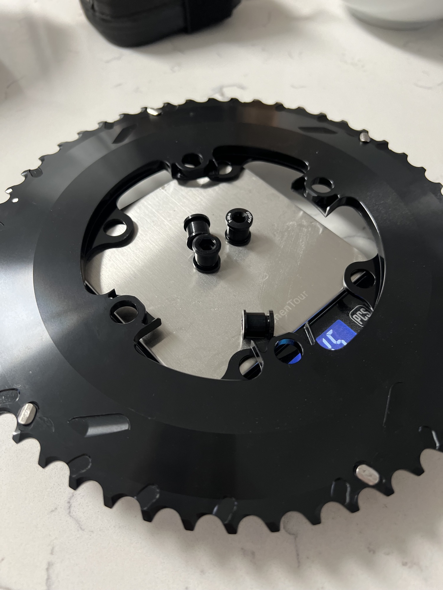
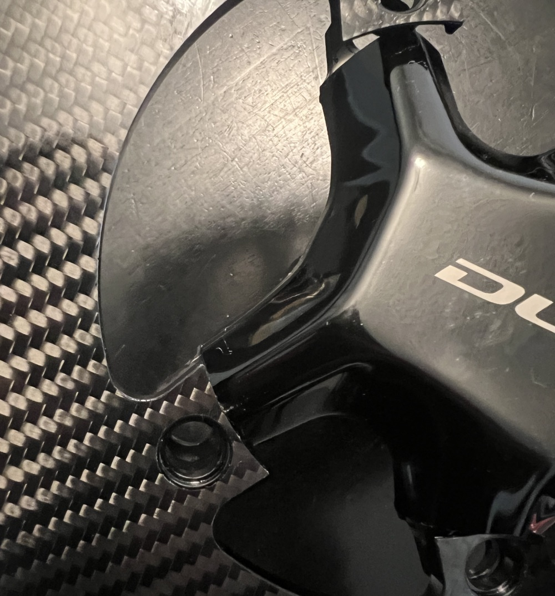
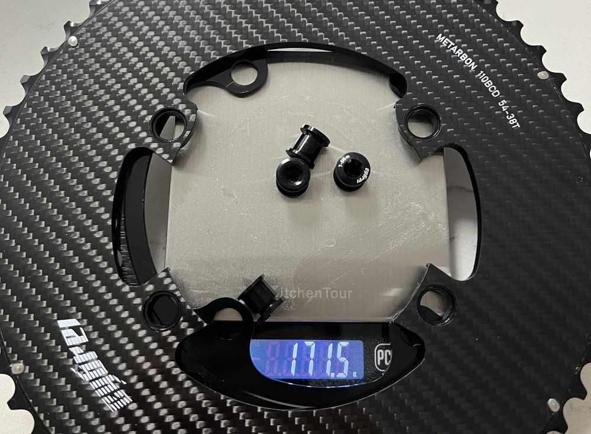

I ordered these chainrings in hopes of finding a less expensive alternative to the Carbon-Ti chainrings (which have treated me pretty well). At ~$200 compared to $270 for just the Carbon-Ti outer ring, the savings seemed worth it.

I got the 54/38 version, which despite the big ratio difference, my front derailleur was able to cope with. The 54t is a game changer, and it's nice to still have a usable climbing gear compared to the normal 40t Shimano ratio.

The inner chainring is a normal chainring, no carbon to be found. The outer seems to be the exact same as their aluminum chainring, but with a plate of carbon fiber epoxied to the top. They even recommend using their own chainring bolts because the rings are thicker due to adding the carbon layer. This means the chainring is HEAVIER than the aluminum version. Facepalm.

This is truly the AliExpress version of carbon chainrings. At least they look good and shift well, I guess.

### Compatibility

Despite what the listing says, they DO NOT work with Shimano 12 speed cranks. There is not enough clearance, and the seller confirmed I could not get it to fit. I was planning to use them with the [ELILEE X-Novanta Crankarms](/eliilee-x-novanta-crankarms/) anyway, so it wasn't a major issue for me.

### 3,000 Miles Later

Shifting performance was actually superb the entire time. Even with the smaller 38t inner ring, shifting was crisp and reliable. Tooth wear was acceptable.

After about 3,000 miles I've removed these chainrings. The carbon layer delaminated from the metal ring, which caused creaking issues I couldn't resolve. I've since switched to a Carbon-Ti chainring which has been perfectly silent.

### Verdict

Do not recommend. The weight is heavier than the aluminum version (defeating the purpose), compatibility with Shimano 12-speed cransk is a lie, and the carbon lamination failed after 3,000 miles.

Newer models look slightly different so CYBREI may have improved the lamination, but given my experience with these first-batch production units, just spend the extra $70 and get Carbon-Ti. You can still run a lighter outer ring with your stock inner ring as inner rings are the same weight across brands and don't impact shifting.

<a target="_blank" href="https://www.aliexpress.us/item/3256805648478194.html" class="btn btn-outline-success btn-lg btn-round ml-1">View on Aliexpress</a>
<a target="_blank" href="https://www.pandapodium.cc/product/cybrei-carbon-chainrings/" class="btn btn-outline-success btn-lg btn-round ml-1">View on PandaPodium</a>

Disclosure: I purchased this with my own money. I have had no communication with the manufacturer and all thoughts/opinions are my own.