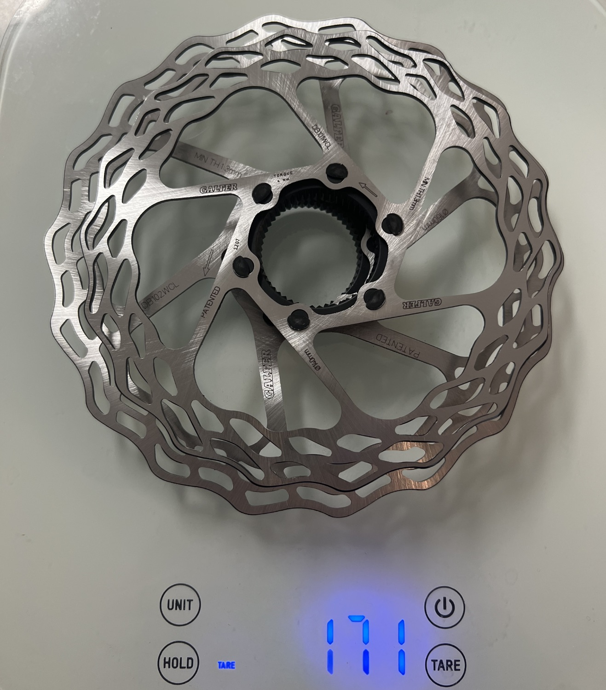

After putting roughly 20,000 miles on these across 6 pairs of rotors, I can give a pretty complete picture of what to expect. The riding has been mostly climbing and pushing descents on dirt roads and pavement around Boulder—not gentle conditions by any means.

Not only do they look fantastic, but they are the same weight as the super expensive Carbon-Ti rotors (and even lighter in the center lock variety). At ~$70 compared to $240 for Carbon-Ti, the value proposition is hard to beat.

### The Good

For everyday riding, these rotors are quiet and perform exactly as you'd expect. Braking power is solid, and they've held up well through hard braking and wet conditions over thousands of miles.

### The Not So Good

**Contamination sensitivity:** This is the biggest downside. These rotors are noticeably more prone to contamination than stock Shimano or SRAM rotors. I'm not sure if it's the increased number of holes, the metal composition, or the thinner profile—but when they get contaminated, they're done. No amount of sanding, alcohol, or harsh chemicals will bring them back. You just have to toss them. I suspect they're more sensitive to oil or other contaminants you pick up on the road in harsh conditions.

**Overheating under extreme braking:** I've overheated the front brake once when braking from 50+ mph on a straightaway to a complete stop. This was with a 160/140 setup. Worth noting that performance does degrade under extreme emergency braking situations.

**Noise in wet/cold:** They are normally quiet, but they get noticeably louder than I'd expect when wet or in extremely cold conditions. I've run both stock Shimano organic pads and stock SRAM organic pads (with some metal content), and both exhibit this behavior.

### Availability (The Real Problem)

Here's the unfortunate news: Galfer has essentially stopped distributing MTB and road bike disc rotors in the USA. They've shifted entirely to motorcycle rotors and basically abandoned the bicycle market. The only way to get them now is through eBay or importing from Europe.

This is a huge bummer, because it makes them very hard to recommend to US buyers despite how much I like them.

### Verdict

If you can get your hands on them, I still consider these the gold standard between price, weight, and performance. But the availability situation in the US makes it a harder recommendation than it used to be. If you're in Europe or don't mind importing, go for it. If you need something you can easily source domestically, you might want to look elsewhere.

Measured weights:
- Center Lock 140mm: 75g
- Center Lock 160mm: 96g
- Combined: 171g

Disclosure: I purchased these with my own money. I have had no communication with the manufacturer and all thoughts/opinions are my own.