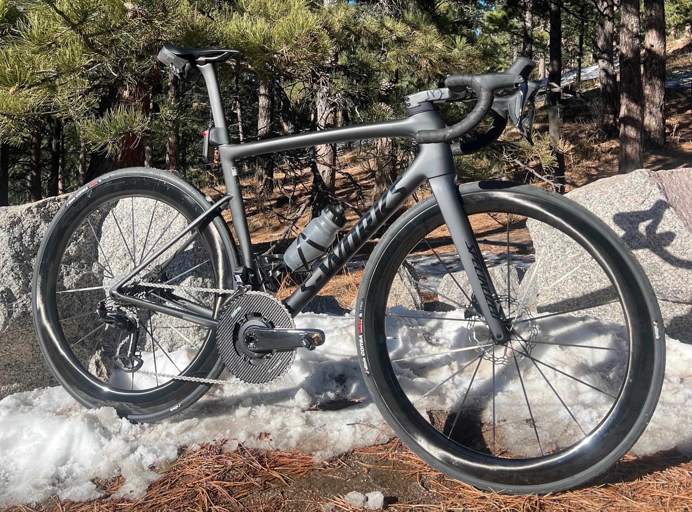
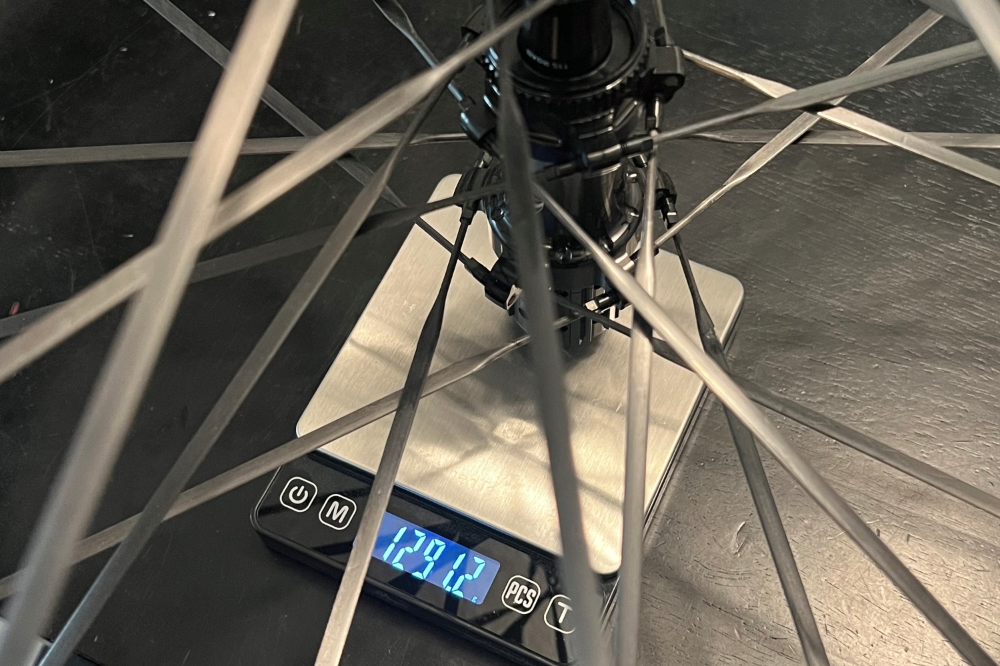

The Craft Racing Works wheels are some of the lightest-but-still-affordable aero wheels on the market. For me, they check all the boxes:
- [x] Hooked rims
- [x] Low weight
- [x] Easy to replace bearings
- [x] Replacement spokes are available if needed 
- [x] Minimal logos

I was able to order the CS5060 wheelset with the front wheel from the CS5055. The main difference is that the front wheel from the CS5060 is much wider, and has a minimum tire width of 29mm. The wider rims are more stable in crosswinds, but are less aero.

I've done a few rides on them and have had no issue. The "whoosh" noise is minimal for wheels this deep, and they are plenty stiff given their weight. Excited to put some miles on them over the next few months and see how it all turns out! 

Here's the specs:

- Front wheel:
    - Rim Depth: 50mm
    - Internal Rim Width: 21mm
    - External Rim Width: 29mm
    - No. of Spokes: 16
    - Min. Tire Size: 24mm
    - Max. Tire Size: 40mm
    - Max. Tire Pressure: 120psi @ 25mm
    - Thru Axle Size: 100 x 12mm

- Rear wheel:
    - Rim Depth: 60mm
    - Internal Rim Width: 21mm
    - External Rim Width: 29mm
    - No. of Spokes: 20
    - Min. Tire Size: 24mm
    - Max. Tire Size: 40mm
    - Max. Tire Pressure: 120psi @ 25mm
    - Thru Axle Size: 142 x 12mm
    - Freehub: 36T Star Ratchet. Shimano 11s, SRAM XDR or Camp. compatible options.

