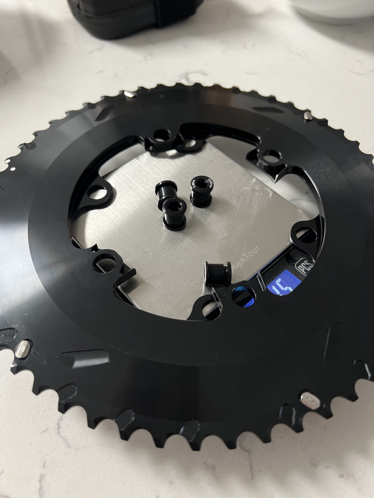
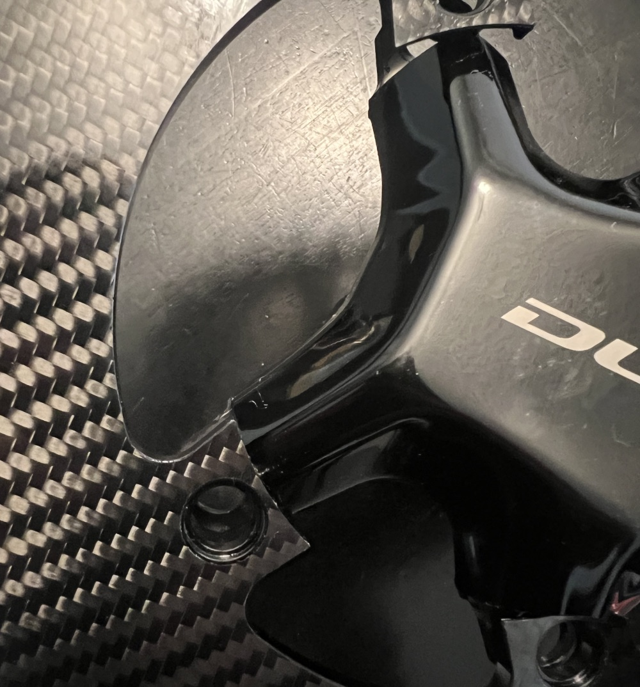
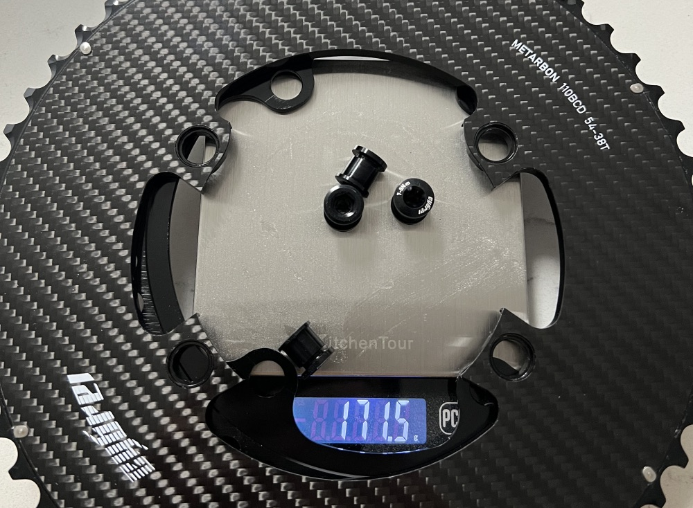

I ordered these chainrings in hopes of finding a less expensive alternative to the Cabron-Ti chainrings (which have treated me pretty well). These have been pretty disappointing though, especially considering the price.

I got the 54/38 version, which despite the big difference, my front derailleur was able to cope. The 54t is a game changer, and it's nice to still have a usable climbing gear compared to the normal 40t Shimano ratio.

 

The inner chainring is a normal chainring, no carbon to be found. The outer seems to be the exact same as their aluminum chainring, but with a plate of carbon fiber epoxied to the top. They even recommend using their own chainring bolts because the rings are thicker due to adding the carbon layer. This means the chainring is HEAVIER than the aluminum version. Facepalm.

This is truly the aliexpress version of carbon chainrings. At least they look good and shift well, I guess.

 

One thing to note is that despite what the listing says, they DO NOT work with Shimano 12 speed cranks. There is not enough clearance, and the seller said I could not get it to fit. At least I was planning to use them with the [ELILEE X-Novanta Crankarms](/eliilee-x-novanta-crankarms/), so it wasn't a major issue.

The weight is just okay. Much heavier than carbon-ti, but I'm a fan of the look so I can look past it for now.

<a target="_blank" href="https://www.aliexpress.us/item/3256805648478194.html" class="btn btn-outline-success btn-lg btn-round ml-1">View on Aliexpress</a>
<a target="_blank" href="https://www.pandapodium.cc/product/cybrei-carbon-chainrings/" class="btn btn-outline-success btn-lg btn-round ml-1">View on PandaPodium</a>

Disclosure: I purchased this with my own money. I have had no communication with the manufacturer and all thoughts/opinions are my own.