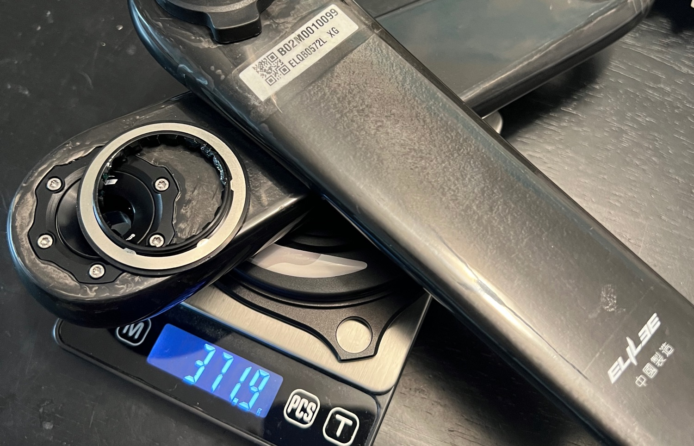
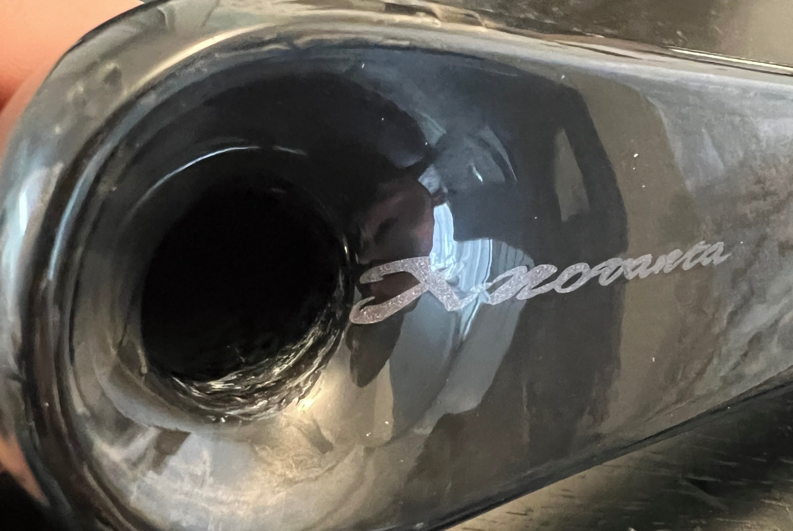
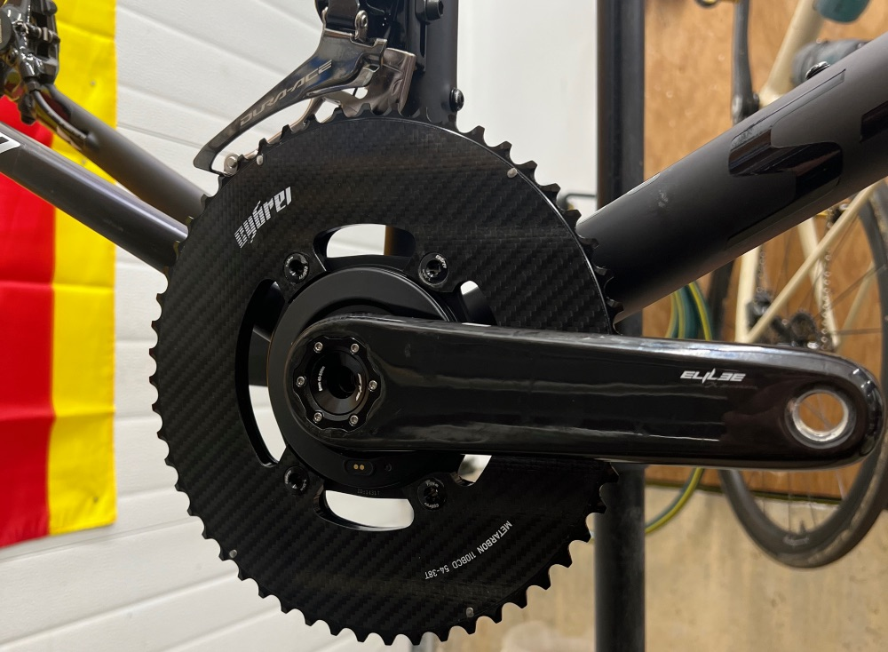

After having a friend try out these cranks for a few months, I finally decided to pull the trigger and test them out. They sell two different versions, one with an aluminum 24mm spindle, and one with a 28mm spindle (which can be adapted to DUB or 30mm using included spacers). The 24mm spindle is heavier, and made of aluminum, which has been known to crack at times. The overall weight might be the same, as the 30mm spindle requires a heavier bottom bracket. 

The compression mechanism uses an adjustment rim very similar to SRAM cranks, which is easy to fine-tune and get set up. I have mine set up using a BSA30 bb from Omni Racer, and getting it set up using the spacers was no big issue. 

The biggest selling point to me is that the spindle connection interface is entirely metal. I've run into issues with the latest THM cranks where the arm eventually loosens due to the carbon-on-carbon interface. For ~40g more weight, you get a more accurate power meter, the ability to use 4 or 5 bolt chainrings, preload adjustment, a metal spindle interface, and modularity if something goes wrong with the arms or power meter.

 

There are some questionable finishings on the inside of the left arm, but they seem to be purely cosmetic so I am not worried.

 

For the power meter, I went with a Sigeyi AXO power meter. The cranks came without the correct tool to install the spider onto the cranks, but I was able to have a shop torque it down. The correct tool you need is a BBT-22.

Looking forward to putting some miles on these and reporting back! As always, feel free to share your thoughts below.

<a target="_blank" href="https://www.aliexpress.us/item/3256804975926457.html" class="btn btn-outline-success btn-lg btn-round ml-1">View on AliExpress</a>

Disclosure: I purchased this with my own money on Aliexpress. I have had no communication with the manufacturer and all thoughts/opinions are my own.