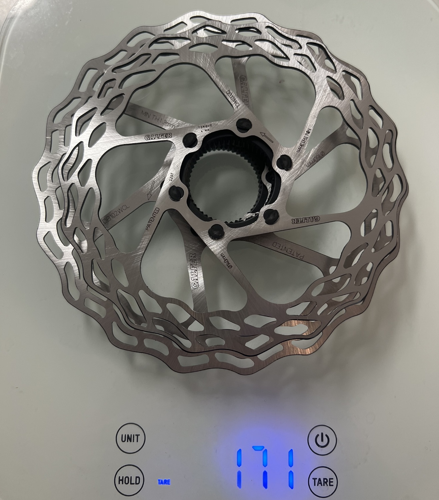

After putting nearly 6,000 miles on these through lots of gravel, hard braking, and wet conditions, I can confidently recommend these rotors. Not only do they look fantastic, but they are the same weight as the super expensive Carbon-Ti rotors (and even lighter in the center lock variety).

Measured weights:
- Center Lock 140mm: 75g
- Center Lock 160mm: 96g
- Combined: 171g

<a target="_blank" href="https://www.galferusa.com/shop/bike/bike-rotors/road-bicycle-wave-rotor-center-lock-160mm-x-1-8mm-98-grams-front-or-rear-rotor-db102wcl" class="btn btn-outline-success btn-lg btn-round ml-1">View on GalferUSA</a>

Disclosure: I purchased this with my own money. I have had no communication with the manufacturer and all thoughts/opinions are my own.