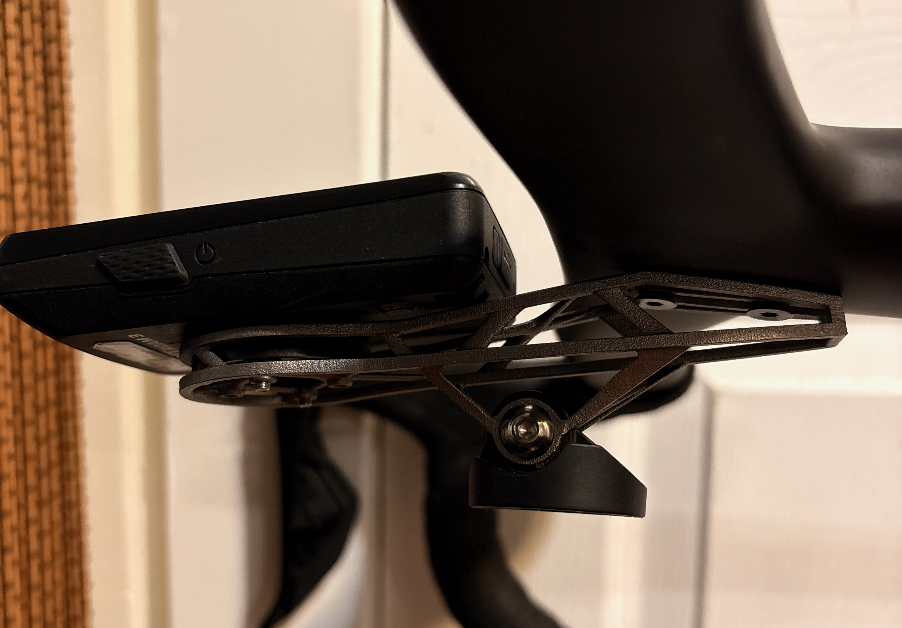
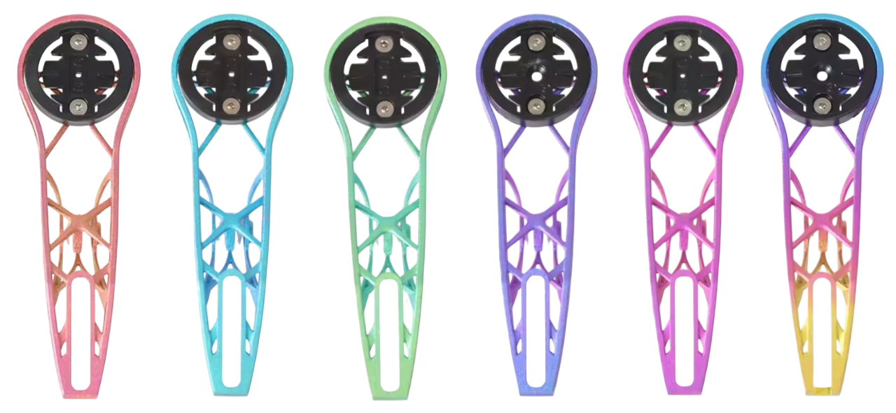

I have four of these mounts. They're a clone of the [Syncros iC SL INSPIR3D](https://www.syncros.com/us/en/product/syncros-ic-sl-inspir3d-front-comp-mount) computer mount that Scott made for the Addict RC, but with an added GoPro adapter underneath. At $30-40 on AliExpress when on sale, they're a fraction of the cost of the Syncros original.

### Overview

|   | RRSKIT Ti Mount (hollow) | Syncros iC SL INSPIR3D | Stock Carbon/Plastic Mount |
|---|---|---|---|
| Weight | 25g | 12g (short) / 15g (long) | ~15-20g |
| Material | 3D Printed Ti | 3D Printed Alloy | Plastic/Carbon |
| Price | ~$30 | $110 | Included |
| GoPro Mount | Yes | No | Yes (added weight) |

### Specs

- **Material:** 3D-printed titanium alloy
- **Weight:** 25g (hollowed version)
- **Mounting:** Two-bolt direct mount (integrated handlebar standard)
- **Computer compatibility:** Garmin quarter-turn base
- **Accessories:** GoPro/light mount included

### The Good

Make sure you get the hollow version that looks like the Syncros mount. RRSKIT also sells a non-hollow "long" version and it flexes like crazy, so avoid that one.

The hollow version is the only mount I have found that does not flex with a Wahoo Roam V2 and a Cycliq Fly12 Sport mounted underneath. I've tried other similar mounts, including solid metal ones, and they all had some amount of flex on rough roads. This one is rock solid. Build quality has been great across all four of mine.

I've used these on the [Avian Canary](/avian-canary-handlebars-first-ride-impressions/), [Avian Parus](/avian-parus-handlebar-review/), and a Scott Addict RC Pro with the stock Syncros bars without any issues once set up properly. On the Scott it worked with plastic spacers to get the angle right, which makes sense given it's a clone of the Scott mount.

### Wahoo Compatibility

The included quarter-turn adapters are not good. The mount is designed for Garmin, and because the Wahoo is rotated compared to Garmin, the bolts end up on the left and right side of the adapter. This leaves an air gap at the top and bottom where the screws aren't, which means the adapter moves as you ride and causes a rattle.

I fixed this by wrapping electrical tape around the support sections to fill the gap so there's no wiggle room. I also angled the adapter down so the bottom of my Wahoo contacts the mount below the adapter, which locks it in place. It looks a little rough if someone looks underneath but it's not too bad.

### Mount Angle

The default angle is tilted down at a negative angle which is not usable in my opinion. I'd recommend adding plastic shims where you attach the mount to the bars to flatten it out. Once shimmed, it sits perfectly level.

### Color Options

Some sellers offer anodized versions in bright colors but they come at a big price premium. I've stuck with the standard titanium silver color. It looks fine and keeps the cost down. But the flashy colors do look sweet!

### Verdict

I recommend these with some caveats. The mount itself is fantastic for the price. Rock solid, no flex, and the titanium build quality is great. But if you're running a Wahoo you'll need to do some tweaking with tape and shims to get it set up properly. If you're on Garmin it's probably plug and play.

The other thing worth mentioning is that Syncros doesn't even make a version of their mount with a GoPro adapter. So if you want to run a camera or light underneath, this is basically your only option in this form factor. For $30-40 you get the GoPro mount built in, which Syncros charges more for and still doesn't offer.

<a target="_blank" href="https://www.amazon.com/QYQAY-MountUltra-Lightweight-MountCompatible-2-5-inchBike-ComputersRoad/dp/B0G6ZFWYHK/" class="btn btn-outline-success btn-lg btn-round ml-1">View on Amazon</a>
<a target="_blank" href="https://www.aliexpress.us/w/wholesale-rrskit-3d-print-titanium.html" class="btn btn-outline-success btn-lg btn-round ml-1">View on AliExpress</a>

Disclosure: I purchased this with my own money. I have had no communication with the manufacturer and all thoughts/opinions are my own.
