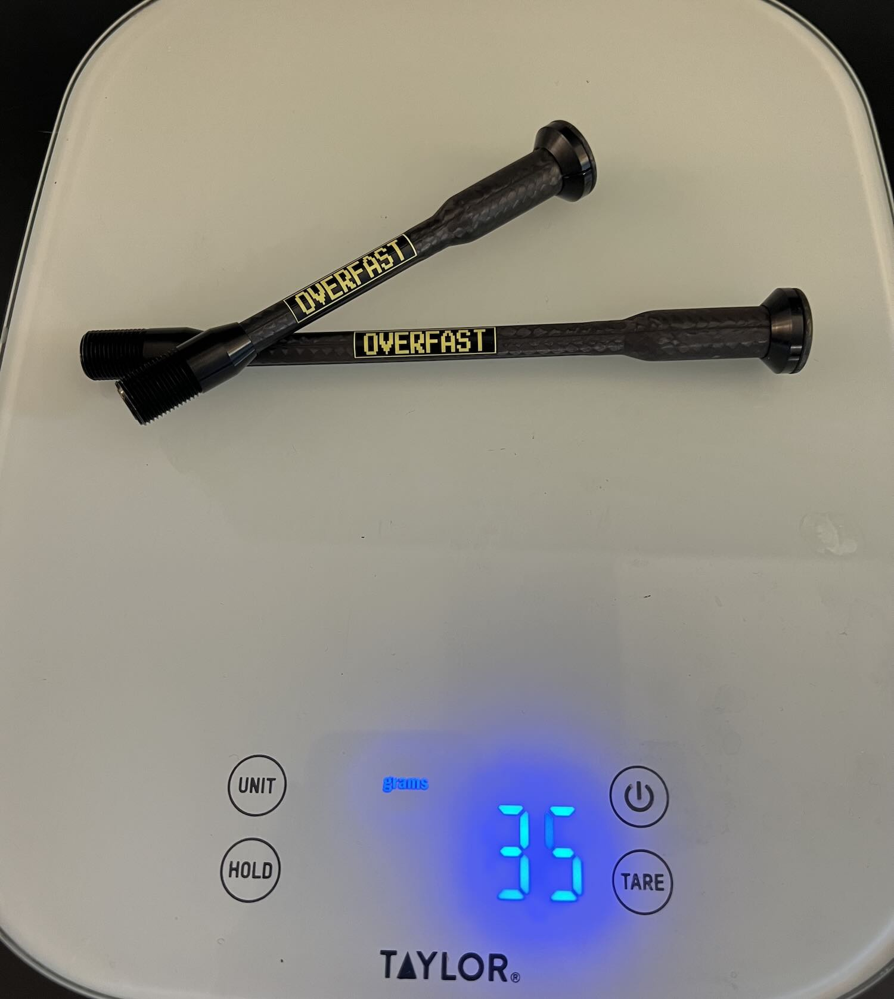

I don't think about thru-axles very often. They thread in, they hold the wheel, that's about it. But when I was looking for the last few grams on my Aethos build, Overfast's carbon pair caught my eye. They weighed 35g on my scale versus 50g for the stock Specialized axles. I bought them in June 2023 and have had them on the bike for nearly three years now, roughly 10,000 miles including a lot of rough dirt roads.

### Overview

|   | RideNow Ti | Sixweel Ti | CS Ti (Fair Wheel) | Overfast Carbon | Stock Specialized |
|---|---|---|---|---|---|
| Weight (pair) | ~26g | ~29g | ~31.5g | 35g | 50g |
| Price (USD) | $220 | $175 | $160 | $220 | Included |
| Material | Titanium | Grade 5 Titanium | TC11 Ti / 7075 Al | Carbon/Alloy/Ti | Aluminum |

### Installation

The threads are tighter than stock, so grease them well and start by hand. If you're not careful you'll cross-thread them. Recommended torque is 7.5-9Nm. Do not use assembly paste on these.

Panda Podium sent me a follow-up email after my order warning that you need to insert your hex wrench at least 15mm into the socket, and that using a shallow tool will damage the axle and void the warranty. I have never thought about hex key insertion depth on a thru-axle before. Use a full-length hex key, not a short L-key.

That 15mm requirement is also a problem on the road. If you flat and need to pull the wheel, most multi-tool hex bits aren't long enough. You can probably get the axle threaded back in, but you're chewing up the carbon hex interface every time. Stock axles don't care what tool you use.

On the Aethos, the conical head sits a bit shallower than the stock axles, so it doesn't sit perfectly flush at the fork. Doesn't affect anything functionally.

### Durability

The axles are fine structurally after 10,000 miles. No issues with the carbon-alloy bond or the threads. The carbon hex socket is another story. It's already showing wear marks from the Allen key. Nothing has rounded out yet, but the wear is there, and I think it'll get worse if you're pulling axles regularly for travel or wheel swaps. This should just be a metal interface.

They also creak. Not from the threads, but from the carbon shaft contacting the wheel hub. I had to grease the entire body of the axle, not just the threads, to stop it. Before I figured that out, the creaking was bad enough that it actually smelled like something was melting or generating heat from the friction. That was unsettling. Once you grease the full shaft they're quiet, but if you forget or go light on it, you'll hear it on the ride.

### Verdict

When Overfast released these, they were the only lightweight thru-axle on the market. Since then, titanium options from Sixweel, RideNow, and others have shown up. They're lighter, they cost the same or less, and you don't have to worry about the hex socket wearing out or greasing the threads to stop creaking. Titanium with a metal hex interface is just going to last longer.

The Overfast axles do look better. The carbon weave has a look that titanium doesn't. But that's the only reason I'd pick them over a ti pair at this point. If you're buying lightweight thru-axles today, go titanium.

<a target="_blank" href="https://pandapodium.cc/products/overfast-carbon-thru-axle" class="btn btn-outline-success btn-lg btn-round ml-1">View on Panda Podium</a>

Disclosure: I purchased this with my own money and have no relationship with Overfast.
